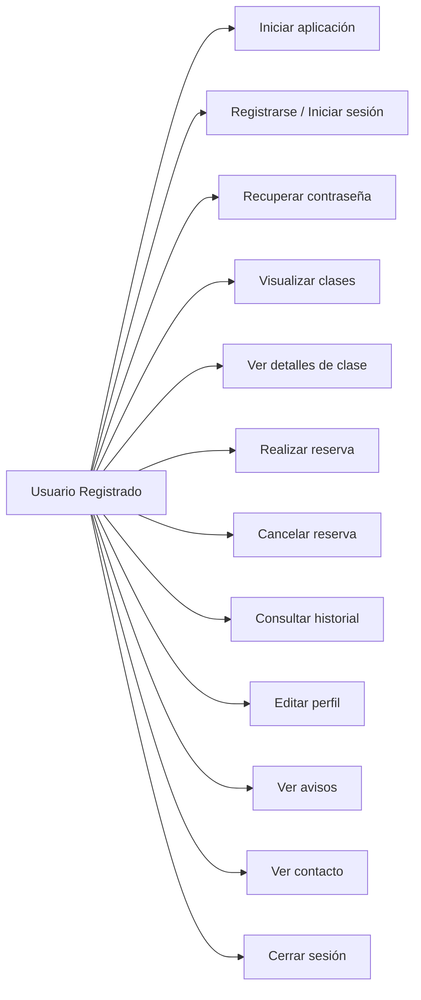
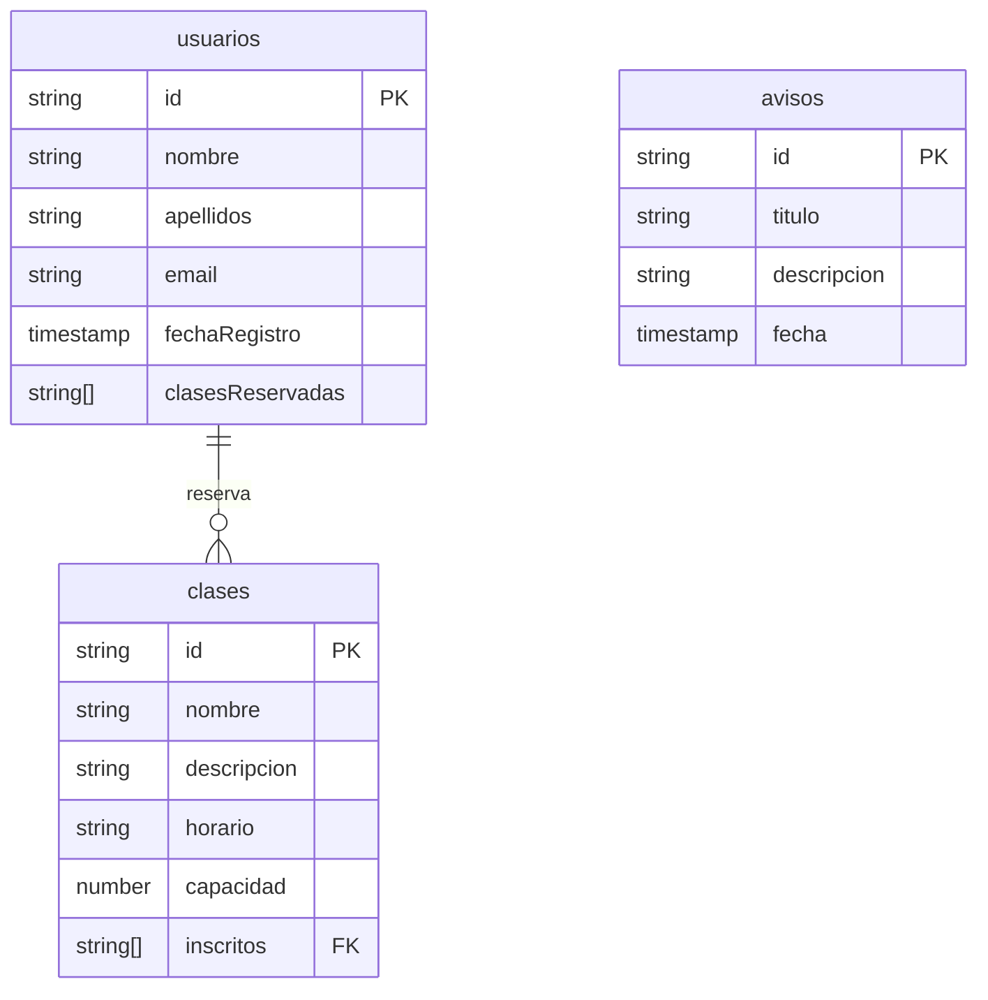

# 💪 EuroGym App

Aplicación móvil desarrollada como parte del *Trabajo de Fin de Ciclo* para la gestión integral de un gimnasio.  
Permite a los usuarios registrarse, visualizar clases disponibles, reservar su plaza, gestionar su perfil, ver su historial de reservas y recibir notificaciones importantes.

---

## 📚 Índice

1. [🎯 Objetivo del proyecto](#-objetivo-del-proyecto)  
2. [🚀 Funcionalidades](#-funcionalidades)  
3. [🛠️ Tecnologías y herramientas](#️-tecnologías-y-herramientas)
4. [📄 Modelo de Datos](#️-modelo-de-datos)
5. [📂 Estructura de carpetas](#️-estructura-de-carpetas)
6. [📱 Capturas de pantalla](#-capturas-de-pantalla)  
7. [🔥 Estructura de Firebase](#-estructura-de-firebase)   
8. [🧪 Instalación y ejecución](#-instalación-y-ejecución)  
9. [👤 Autor](#-autor)  
10. [📌 Consideraciones finales](#-consideraciones-finales)

---

## 🎯 Objetivo del proyecto

Desarrollar una aplicación Android moderna para cubrir las necesidades de gestión de clases de un gimnasio que actualmente lleva a cabo una gestión manual y poco profesional.
Con esto se busca:

- Agilizar las *reservas de clases* por parte de los usuarios del gimnasio.
- Facilitar el control de *capacidad y asistencia* a cada una de las clases.
- Ofrecer una experiencia *intuitiva, limpia y funcional*, lo que hará que el comercio destaque ante sus competidores en el mercado.
- Implementar una interfaz de usuario intuitiva y sencilla.
- Implementar una interfaz que represente la imagen del negocio.

---

## 🚀 Funcionalidades

- *Registro / login* con email y contraseña
- *Recuperación de contraseña* desde la app
- *Visualización semanal* de clases por día
- *Reserva y cancelación de plazas* en tiempo real
- *Control automático de aforo*
- *Bloqueo de clases pasadas*
- *Historial de reservas personales*
- *Edición de datos personales*
- *Notificaciones desde Firebase*
- *Pantalla de contacto* con acceso a ubicación
- *Persistencia de datos* en Firestore

---

## 🛠️ Tecnologías y herramientas

- *Lenguaje:* Kotlin + Jetpack Compose
- *Base de datos:* Firebase Firestore
- *Autenticación:* Firebase Auth
- *Seguimiento:* Firebase Crashlytic
- *Mensajería push:* Cloud Messaging
- *UI Framework:* Material 3
- *Librerías:*
  - Coil (carga de imágenes)
  - Firebase SDK
  - StateFlow + ViewModel
- *IDE:* Android Studio

---

## 🛠️ Modelo de Datos

A continuación se muestran los diagramas de casos de uso principales con sintaxis Mermaid válida.

### Casos de Uso para **Usuarios Registrados**


---
### 📄 Modelo de datos Firestore

---
## 📂 Estructura de carpetas

### Backend
```
EurogymClass/
├── .gradle/
├── .idea/
├── app/
│   ├── build/
│   └── src/
│       ├── androidTest/
│       └── main/
│           ├── java/
│           │   └── com.example.eurogymclass/
│           │       ├── avisos/
│           │       │   └── AvisosScreen.kt
│           │       ├── data/
│           │       │   ├── Clase.kt
│           │       │   └── Usuario.kt
│           │       ├── perfil/
│           │       │   ├── EditarPerfilScreen.kt
│           │       │   ├── HistorialReservasScreen.kt
│           │       │   └── PerfilScreen.kt
│           │       ├── screens/
│           │       │   ├── auth/
│           │       │   ├── bienvenida/
│           │       │   ├── clases/
│           │       │   └── contacto/
│           │       ├── ui.theme/
│           │       │   ├── Color.kt
│           │       │   ├── Theme.kt
│           │       │   └── Type.kt
│           │       ├── utilidades/
│           │       │   ├── Reutilizables.kt
│           │       │   └── Sesion.kt
│           │       ├── viewmodels/
│           │       │   ├── AvisosViewModel.kt
│           │       │   └── UsuariosViewModel.kt
│           │       ├── MainActivity.kt
│           │       └── Navigation.kt
│           └── res/
│           └── AndroidManifest.xml
├── readmeImagenes
├── build.gradle
├── gradle.properties
└── settings.gradle
```
---
## 📱 Capturas de pantalla

---
## 🔥 Estructura de Firebase

La aplicación **EuroGymClass** utiliza **Firebase** como backend principal, aprovechando varias de sus funcionalidades para gestionar usuarios, almacenar datos en tiempo real y enviar notificaciones.

### 📚 Firestore – Base de datos NoSQL

La base de datos está estructurada en colecciones documentales, adaptadas a la lógica del proyecto:
```
Firestore
├── usuarios/
│ └── {uid}
│ ├── nombre
│ ├── apellidos
│ ├── email
│ └── clasesReservadas: [idClase1, idClase2, ...]
├── clases/
│ └── {idClase}
│ ├── nombre
│ ├── descripcion
│ ├── fecha
│ ├── capacidad
│ └── inscritos: [uid1, uid2, ...]
├── avisos/
│ └── {idAviso}
│ ├── titulo
│ ├── mensaje
│ └── fechaPublicacion
```
> 🔁 **Relación entre colecciones:**  
> Las reservas se gestionan directamente en cada documento de `clases` mediante una lista de UIDs. En paralelo, se mantiene un historial en `usuarios`.


### 🔐 Firebase Authentication

- Registro e inicio de sesión con **correo y contraseña**.
- Inicio de sesión con **Google**.
- Recuperación de contraseña integrada.
- Protección de rutas mediante sesión activa.


### 📩 Firebase Cloud Messaging (FCM)

- Envío de notificaciones **en tiempo real** a los usuarios.
- Lectura automática de avisos desde la colección `avisos`.


### 🔒 Reglas de seguridad de Firestore

Se aplican reglas personalizadas que:

- ✅ Permiten a los usuarios acceder **solo a su información**.
- ❌ Restringen la edición de clases y avisos a personal administrativo.
- 🔐 Protegen los datos sensibles mediante autenticación y permisos.


Esta estructura garantiza un modelo seguro, escalable y fácil de mantener, cumpliendo con los principios de buenas prácticas en aplicaciones móviles conectadas a la nube.
---


