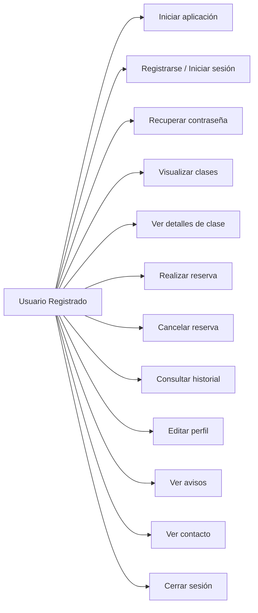
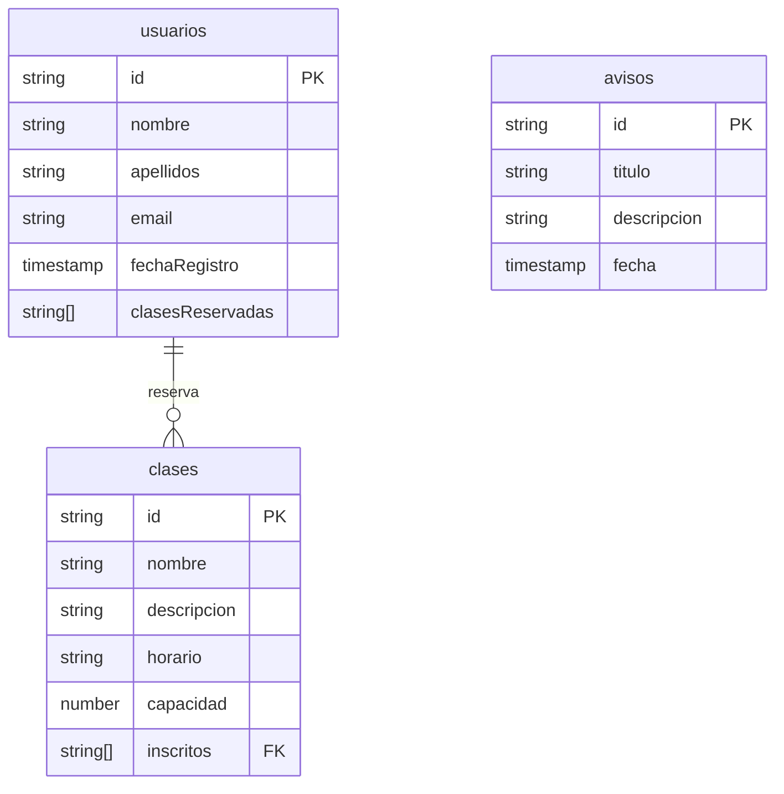

# 💪 EuroGym App

Aplicación móvil desarrollada como parte del *Trabajo de Fin de Ciclo* para la gestión integral de un gimnasio.  
Permite a los usuarios registrarse, visualizar clases disponibles, reservar su plaza, gestionar su perfil, ver su historial de reservas y recibir notificaciones importantes.

---

## 📚 Índice

1. [🎯 Objetivo del proyecto](#-objetivo-del-proyecto)  
2. [🚀 Funcionalidades](#-funcionalidades)  
3. [🛠️ Tecnologías y herramientas](#️-tecnologías-y-herramientas)
4. [🛠️ Modelo de Datos](#️-modelo-de-datos)
5. [📱 Capturas de pantalla](#-capturas-de-pantalla)  
6. [🏗️ Arquitectura del proyecto](#️-arquitectura-del-proyecto)  
7. [☁️ Estructura de Firebase](#-estructura-de-firebase)   
8. [🧪 Instalación y ejecución](#-instalación-y-ejecución)  
9. [👤 Autor](#-autor)  
10. [📌 Consideraciones finales](#-consideraciones-finales)

---

## 🎯 Objetivo del proyecto

Desarrollar una aplicación Android moderna para cubrir las necesidades de gestión de clases de un gimnasio que actualmente lleva a cabo una gestión manual.
Con esto se busca:

- Agilizar las *reservas de clases* por parte de los usuarios del gimnasio.
- Facilitar el control de *capacidad y asistencia* a cada una de las clases.
- Ofrecer una experiencia *intuitiva, limpia y funcional*, lo que hará que el comercio destaque ante sus competidores en el mercado.

---

## 🚀 Funcionalidades

- *Registro / login* con email y contraseña
- *Recuperación de contraseña* desde la app
- *Visualización semanal* de clases por día
- *Reserva y cancelación de plazas* en tiempo real
- *Control automático de aforo*
- *Bloqueo de clases pasadas*
- *Historial de reservas personales*
- *Edición de datos personales*
- *Notificaciones desde Firebase*
- *Pantalla de contacto* con acceso a ubicación
- *Persistencia de datos* en Firestore

---

## 🛠️ Tecnologías y herramientas

- *Lenguaje:* Kotlin + Jetpack Compose
- *Base de datos:* Firebase Firestore
- *Autenticación:* Firebase Auth
- *UI Framework:* Material 3
- *Librerías:*
  - Coil (carga de imágenes)
  - Firebase SDK
  - StateFlow + ViewModel
- *IDE:* Android Studio

---

## 🛠️ Modelo de Datos

A continuación se muestran los diagramas de casos de uso principales con sintaxis Mermaid válida.

### Casos de Uso para **Usuarios Registrados**


---
### Diagrama de clases

---
### Diagrama Entidad - Relación
```mermaid
erDiagram
    USUARIOS {
        string uid PK
        string nombre
        string email
        string telefono
        timestamp fechaRegistro
        string[] clasesReservadas
    }

    CLASES {
        string id PK
        string nombre
        string descripcion
        string horario
        number capacidad
        string[] inscritos
    }

    AVISOS {
        string id PK
        string titulo
        string mensaje
        timestamp fecha
    }

    USUARIOS ||--o{ CLASES : "reserva"

