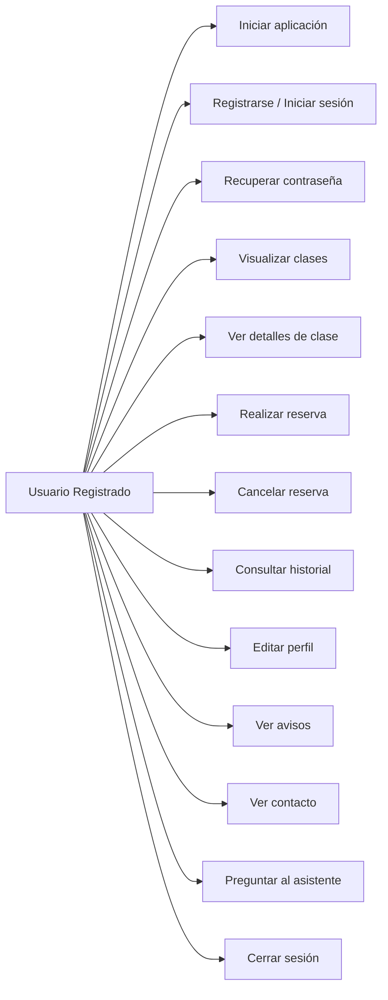
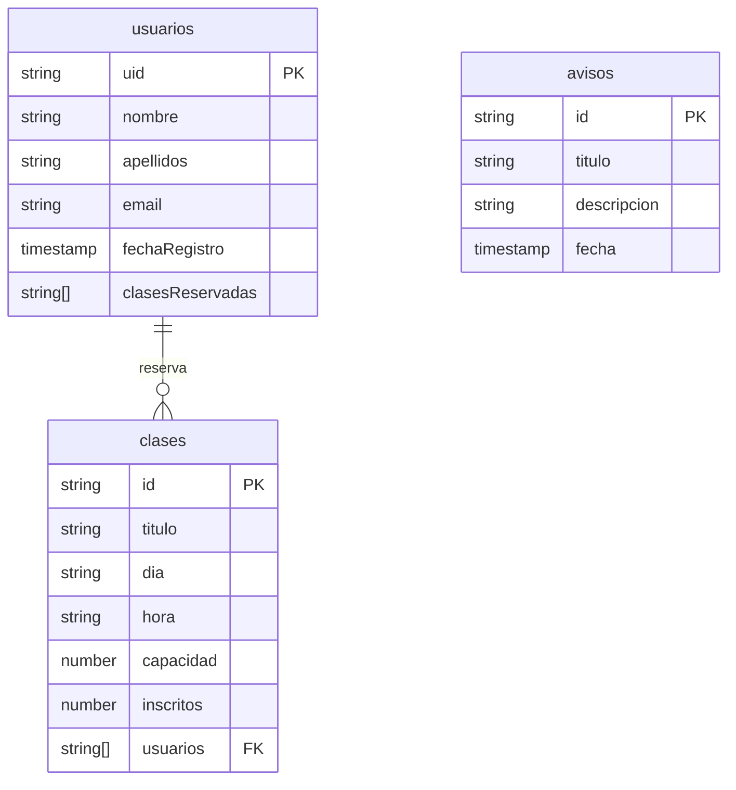
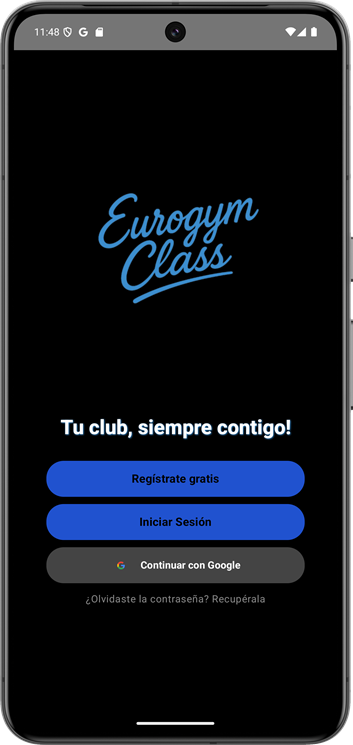
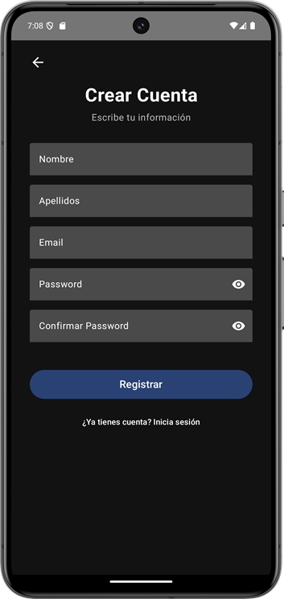
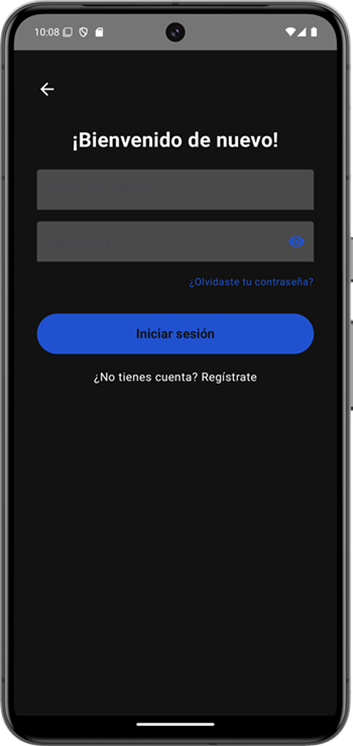
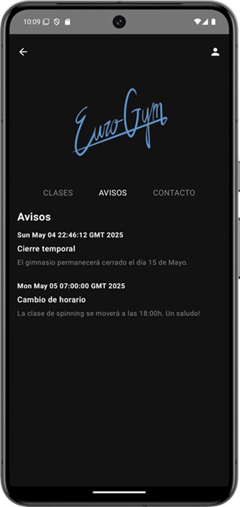
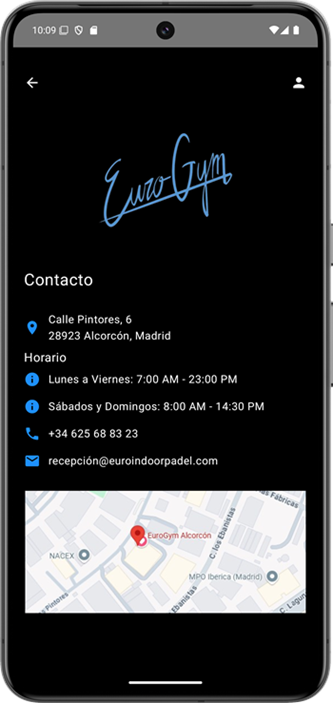
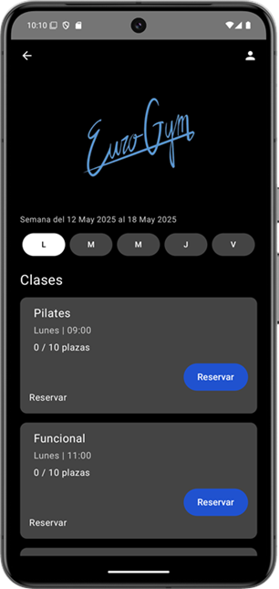

# 💪 EuroGym App

Es una aplicación móvil para dispositivos Android, desarrollada como parte del *Trabajo de Fin de Curso* de DAM (Desarrollo de Aplicaciones Multiplatadorma), su objetivo es la automatizar procesos en la gestión de un gimnasio.  
Permite a los usuarios registrarse mediante email/contraseña o Google, visualizar clases disponibles de la semana, reservar y cancelar su plaza, gestionar su perfil, ver su historial de reservas, consultar información a un asistente virtual y recibir comuniacciones importantes por parte del administrador.

---
## 📚 Índice

1. [🎯 Objetivo del proyecto](#objetivo-del-proyecto)  
2. [🚀 Funcionalidades](#funcionalidades)  
3. [🛠️ Tecnologías y herramientas](#tecnologías-y-herramientas)  
4. [📄 Modelo de Datos](#modelo-de-datos)
5. [📂 Estructura de carpetas](#estructura-de-carpetas)  
6. [📱 Pantallas principales](#pantallas-principales)
7. [🔥 Estructura de Firebase](#estructura-de-firebase) 

---

## 🎯 Objetivo del proyecto

Desarrollar una aplicación moderna para cubrir las necesidades de gestión de clases colectivas de un gimnasio y el envío de notificaciones a los usuarios.
Con esto se busca:

- Agilizar las *reservas de clases* por parte de los usuarios del gimnasio.
- Facilitar el control de *capacidad y asistencia* a cada una de las clases.
- Ofrecer una experiencia *intuitiva, limpia y funcional*, lo que hará que el comercio destaque ante sus competidores en el mercado.
- Implementar una interfaz de usuario intuitiva y sencilla, que representa la imagen del negocio.

---

## 🚀 Funcionalidades

- *Registro / login* con email y contraseña
- *login* con autenticación de Google
- *Recuperación de contraseña* desde la app
- *Visualización semanal* de clases por día
- *Reserva y cancelación de plazas* en tiempo real
- *Control automático de aforo*
- *Bloqueo de clases pasadas*
- *Historial de reservas personales*
- *Edición de datos personales*
- *Notificaciones desde Firebase*
- *Pantalla de contacto* con acceso a ubicación, correo eléctronico y teléfono
- *Persistencia de datos* en Firestore

---

## 🛠️ Tecnologías y herramientas

- *Lenguaje:* Kotlin + Jetpack Compose
- *Backend as a Service:* Firebase
- *Base de datos:* Firebase Firestore
- *Autenticación:* Firebase Auth
- *Errores y analítica:* Firebase Crashlytic
- *Mensajería push:* Cloud Messaging (FCM)
- *Funciones automáticas:* Firebase Functions con Node.js
- *UI Framework:* Material 3
- *Librerías:*
  - Coil (carga de imágenes)
  - Firebase SDK
  - StateFlow + ViewModel
- *IDE:* Android Studio
- *Control de versiones:* Git + GitHub

---

## 🛠️ Modelo de Datos

A continuación se muestran los diagramas de casos de uso principales con sintaxis Mermaid válida.

### Casos de Uso para **Usuarios Registrados**


---
### 📄 Modelo de datos Firestore

---
## 📂 Estructura de carpetas

### Backend
```
EurogymClass/
├── .gradle/
├── .idea/
├── app/
│   ├── build/
│   └── src/
│       ├── androidTest/
│       └── main/
│           ├── java/
│           │   └── com.example.eurogymclass/
│           │       ├── avisos/
│           │       │   └── AvisosScreen.kt
│           │       ├── data/
│           │       │   ├── Clase
│           │       │   └── Usuario.kt
│           │       ├── perfil/
│           │       │   ├── EditarPerfilScreen.kt
│           │       │   ├── HistorialReservasScreen.kt
│           │       │   └── PerfilScreen.kt
│           │       ├── screens/
│           │       │   ├── auth/
│           │       │   ├── bienvenida/
│           │       │   ├── ChatBot/
│           │       │   ├── clases/
│           │       │   └── contacto/
│           │       ├── ui.theme/
│           │       │   ├── ChatBotApi
│           │       │   ├── Color.kt
│           │       │   ├── Theme.kt
│           │       │   └── Type.kt
│           │       ├── utilidades/
│           │       │   ├── Reutilizables.kt
│           │       │   └── Sesion.kt
│           │       ├── viewmodels/
│           │       │   ├── AvisosViewModel.kt
│           │       │   └── UsuariosViewModel.kt
│           │       ├── MainActivity.kt
│           │       ├── Messaging
│           │       └── Navigation.kt
│           └── res/
│           └── AndroidManifest.xml
├── readmeImagenes
├── build.gradle
├── gradle.properties
└── settings.gradle
```
---
## 📱 Pantallas Principales

### 📲 Pantalla de Bienvenida

Pantalla principal de la aplicación, es donde el usuario puede registrarse, iniciar sesión, acceder con Google y recuperar contraseña.

<div align="center">
  
</div>

---
### 📲 Pantalla de registro

Pantalla de registro donde se crea una cuenta de usuario mediante lo campos expuestos.

<div align="center">
  
</div>

---
### 📲 Pantalla de acceso

Pantalla para ingresar a la aplicación a través de correo y contraseña. Dentro de ella se puede recuperar la contraseña o acceder a la pantalla de registro.

<div align="center">
  
</div>

---
### 📲 Pantalla de inicio

Pantalla home de la app, que se ejecuta como primera pantalla una vez ingresadas las credenciales y se permite el acceso. En ella se tiene una sería de enlaces a las diferentes pantallas de la aplicación.

<div align="center">
  
</div>

---

### 📲 Pantalla de Notificaciones

Pantalla de comunicaciones y avisos, implementando Firebase Firestore en tiempo real, donde el usuario observará: fecha del aviso, título y descripción.

<div align="center">
  
</div>

---

### 📲 Pantalla de Contacto

Pantalla de contacto con información del gimnasio y una ubicación que redirije a Google Maps. También se implementa las funcionalidades hacie el teléfono y correo electrónico. 

<div align="center">
  
</div>

---

### 📲 Pantalla de Reserva

Pantalla donde el usuario visualiza las clases de la semana con opción a realizar la reserva de la clase o su cancelación. La aplicación está pensada para que se pueda reservar solo en la semana actual en la que se está. 

En ella se visualiza el título de la clase, día que se imparte, hora de inicio y las plazas disponibles.

<div align="center">
  
</div>

---

## 🔥 Estructura de Firebase

La aplicación EurogymClass utiliza Firebase como backend principal, aprovechando sus servicios en la nube para autenticación, almacenamiento de datos y envío de notificaciones automatizadas.


### 📚 Firestore – Base de datos NoSQL

La base de datos está organizada por colecciones, cada una alineada con los modelos de datos utilizados en la aplicación:
```
Firestore
├── usuarios/
│   └── {uid}
│       ├── nombre
│       ├── apellidos
│       ├── email
│       ├── fechaRegistro
│       └── clasesReservadas: [idClase1, idClase2, ...]
├── clases/
│   └── {idClase}
│       ├── titulo
│       ├── descripcion
│       ├── dia
│       ├── hora
│       ├── capacidad
│       ├── inscritos (int)
│       └── usuarios: [uid1, uid2, ...]
├── historialClases/
│   └── {idHistorial}
│       ├── claseId
│       ├── usuarios: [uid1, uid2, ...]
│       ├── inscritos
│       ├── timestamp
│       └── datos adicionales de clase
├── avisos/
│   └── {idAviso}
│       ├── titulo
│       ├── mensaje
│       └── fechaPublicacion
```
> 🔁 **Gestión de reservas:**  
> La lógica de reservas se gestiona directamente en cada documento de clases con la lista de UIDs.

### 🔐 Firebase Authentication

- Registro e inicio de sesión con **correo y contraseña**.
- Inicio de sesión con **Google**.
- Recuperación de contraseña integrada.
- Cada usuario está vinculado a un documento individual en la colección usuarios.


### 📩 Firebase Cloud Messaging (FCM)

- Envío de notificaciones **en tiempo real** a los usuarios.
- Los usuarios reciben avisos globales mediante suscripción al topic "avisos".
- La app muestra los avisos directamente desde la colección avisos.


### ☁️ Firebase Cloud Functions

- Se utiliza una función programada llamada "reiniciarReservasSemanal".
- Se ejecuta todos los lunes a las 00:00 (hora española).


### 🧯 Firebase Crashlytics

- Permite hacer seguimiento de fallos por dispositivo, versión y usuario.
- Los errores críticos quedan registrados incluso si el usuario no informa manualmente.


---


